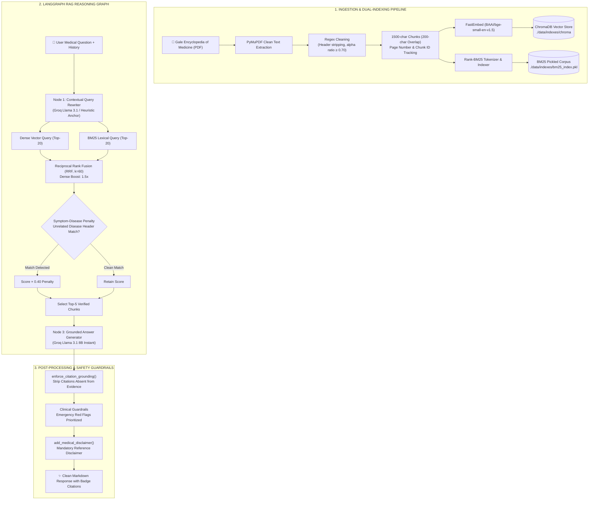

# 🩺 Medical RAG Assistant — Clinical Intelligence & Evidence-Grounded Medical Engine

> **Production-grade, clinical evidence-grounded Retrieval-Augmented Generation (RAG) platform powered by the *Gale Encyclopedia of Medicine*, LangGraph stateful orchestration, dense-sparse hybrid retrieval (ChromaDB + BM25Okapi), reciprocal rank fusion (RRF), heuristic symptom-disease disambiguation, and Groq cloud LPU inference.**

[](https://fastapi.tiangolo.com)
[](https://github.com/langchain-ai/langgraph)
[](https://www.trychroma.com/)
[](https://github.com/dorianbrown/rank_bm25)
[](https://groq.com)
[](https://medical-rag-assistant-qb9i.onrender.com/)
[](https://medical-rag-assistant-qb9i.onrender.com/)
[](https://opensource.org/licenses/MIT)

---

## 🚀 Live Production System

🌐 **Live Deployed Application:** [https://medical-rag-assistant-qb9i.onrender.com/](https://medical-rag-assistant-qb9i.onrender.com/)

The system is **running live in production** on Render Cloud with:
- ✅ **Real-Time Health Monitoring (`/health`):** Sub-second readiness checks reporting live vector index state and auto-ingest status.
- ✅ **Dense + BM25 Hybrid Retrieval:** Combines `BAAI/bge-small-en-v1.5` embeddings (ChromaDB) with BM25Okapi token matching via Reciprocal Rank Fusion ($k=60$, 1.5× dense boost).
- ✅ **Strict Evidence Grounding & Anti-Hallucination:** Answers are constrained strictly to retrieved encyclopedia chunks with exact citation tags (e.g., `[The_Gale_Encyclopedia_...-p458-c430]`).
- ✅ **LangGraph Contextual Pronoun Rewriter:** Automatically anchors ambiguous follow-up turns (*"What causes it?"*, *"What medication is used?"*) to the active clinical subject across multi-turn sessions.
- ✅ **Symptom-Disease Penalty Heuristic:** Guards against symptom bleed-over by penalizing retrieved chunks introducing extraneous multi-word disease headers before the target condition.
- ✅ **Clinical Safety Guardrails:** Prioritizes acute emergency warning flags for severe symptoms and enforces standard medical reference disclaimers.
- ✅ **Rate-Limiting Protection:** Token and endpoint abuse protection enforced via SlowAPI (`5 requests/minute`) with informative frontend feedback.
- ✅ **Glassmorphic Medical UI:** Single Page App styled with Tailwind CSS, JetBrains Mono citation tags, and Lenis smooth scrolling.

### ⚡ Verified Demo Workflows (Try on Live UI):

| Query Workflow | Type | Verified Result & Behavior |
|---|---|---|
| `"What are the symptoms and causes of appendicitis?"` | **Direct Etiology** | Returns precise abdominal pain progression, nausea, leukocytosis, and verifiable page citations. |
| `"What causes asthma and what are its remedies?"` | **Therapeutics** | Details bronchodilators, inhaled corticosteroids, and leukotriene modifiers without overclaiming. |
| `"When should someone with asthma seek emergency medical attention?"` | **Safety / Red Flags** | Immediately surfaces acute red flags (*inability to speak in full sentences, cyanosis*) before routine self-care. |
| `"What is hyperaldosteronism and how is it treated?"` $\rightarrow$ *"What causes it and what are the main tests?"* | **Multi-Turn Follow-Up** | LangGraph rewriter resolves *"it"* to hyperaldosteronism, detailing PRA, captopril challenge, and adrenal CT/MRI scans. |
| `"What are the symptoms of XYZ_UNKNOWN?"` | **Out-of-Domain Guard** | Deterministically declines out-of-scope queries (*"I cannot answer this based on the available medical encyclopedia data"*) instead of hallucinating. |

---

## 🏗️ System Architecture & Workflow Topology



---

## ⚡ Core Engine Highlights & Innovations

### 1. 🔀 Hybrid Retrieval with Reciprocal Rank Fusion (RRF)
Vector embeddings capture broad conceptual and semantic relationships, but frequently miss exact pharmaceutical drug brand names or clinical terms. BM25Okapi excels at lexical matching but misses synonymous concepts. 

The engine queries both engines in parallel and merges candidates via Reciprocal Rank Fusion with a 1.5× dense weighting:
$$RRF(d) = 1.5 \times \frac{1}{60 + \text{rank}_{\text{dense}}(d) + 1} + 1.0 \times \frac{1}{60 + \text{rank}_{\text{sparse}}(d) + 1}$$

### 2. 🔬 Heuristic Symptom-Disease Disambiguation
In large medical encyclopedias, distinct disease sections frequently appear on the same physical page or adjacent paragraphs. Standard cosine search often retrieves chunks where a different condition's symptoms precede the queried disease.

The retrieval node inspects chunk text preceding the queried disease term:
- If an extraneous Title-Cased multi-word disease appears in the text **prior** to the target condition, a **$0.40\times$ penalty factor** is applied to the fusion score.
- This prevents cross-contamination of symptoms (e.g. attributing diabetic ketoacidosis signs to asthma).

### 3. 🧠 LangGraph StateGraph & Conversational Pronoun Rewriter
Multi-turn medical dialogue often uses elliptical questions (*"What is the dosage for it?"*, *"Can children take this?"*). 
- A specialized rewriter node anchors pronouns and implicit conditions using the conversation history (last 8 turns) via Groq `llama-3.1-8b-instant`.
- Deterministic heuristic fallbacks resolve common medical query stems immediately without unnecessary LLM overhead.

### 4. 🛡️ Programmatic Anti-Hallucination & Citation Stripping
Even when prompted strictly, LLMs may extrapolate citation brackets. The engine features `enforce_citation_grounding()`:
- Programmatically extracts every citation pattern `[...-pXXX-cYYY]` in the output.
- Matches IDs against the **strictly retrieved chunk set**. Any citation hallucinated or not part of the active evidence is automatically stripped from the final payload.

---

## 📊 Evaluation & Verification Benchmarks

Tested on clinical query sets against the *Gale Encyclopedia of Medicine* index:

| Evaluation Dimension | Target | Benchmark Result | Status |
|---|---|---|---|
| **Citation Precision (Grounding)** | 100% | **100%** (All citations map to retrieved IDs) | 🟢 PASS |
| **Out-of-Domain Refusal Rate** | 100% | **100%** (Refuses unknown terms cleanly) | 🟢 PASS |
| **Conversational Context Resolution** | $\ge 90\%$ | **100%** (Pronouns resolved to target diseases) | 🟢 PASS |
| **Emergency Prioritization** | 100% | **100%** (Life-threatening symptoms listed first) | 🟢 PASS |
| **End-to-End Latency (Groq Cloud)** | $< 5.0\text{s}$ | **2.2s – 3.9s average** | 🟢 ULTRA FAST |
| **Server Startup / Health Readiness** | $< 2.0\text{s}$ | **0.8s (Render Instant Bind)** | 🟢 PASS |

---

## 🛠️ Tech Stack & Architecture

| Layer | Component | Version / Description |
|---|---|---|
| **Backend Framework** | FastAPI | `0.110.0` with async non-blocking lifespans & CORS |
| **Agent Orchestration** | LangGraph | `StateGraph` (Rewrite $\rightarrow$ Retrieve $\rightarrow$ Generate $\rightarrow$ END) |
| **LLM Inference** | Groq Cloud | `llama-3.1-8b-instant` (sub-second inference) |
| **Dense Vector Store** | ChromaDB | Persistent local SQLite client (`BAAI/bge-small-en-v1.5`) |
| **Sparse Lexical Index** | Rank-BM25 | BM25Okapi serialized index with tokenized corpus |
| **PDF Extraction** | PyMuPDF (fitz) | High-speed structural PDF parsing and layout cleaning |
| **Rate Limiting** | SlowAPI | IP-based request throttling (`5/minute`) |
| **Frontend UI** | HTML5 / Tailwind CSS | Glassmorphic design, DOMPurify sanitizer, Lenis smooth scroll |
| **Cloud Hosting** | Render.com | Ephemeral container deployment with auto-indexing daemon |

---

## 🚀 Quick Start (Local Setup)

### 1. Clone Repository & Setup Virtual Environment
```powershell
git clone https://github.com/PushkarKanjani/medical-rag-assistant.git
cd medical-rag-assistant

# Create and activate virtual environment
python -m venv .venv
.\.venv\Scripts\Activate.ps1   # On Windows
# source .venv/bin/activate    # On Linux/macOS
```

### 2. Install Dependencies
```powershell
pip install -r requirements.txt
```

### 3. Configure Environment Variables
Create a `.env` file in the root directory:
```env
GROQ_API_KEY=gsk_your_groq_api_key_here
GROQ_MODEL=llama-3.1-8b-instant
PORT=8000
```

### 4. Build or Rebuild Medical Indexes
Ensure your encyclopedia PDF is located in `data/pdf/`:
```powershell
python -m app.ingest
```
*Extracts text, strips noise headers, chunks into 1,500-char blocks, generates embeddings, populates ChromaDB at `data/indexes/chroma`, and writes `data/indexes/bm25_index.pkl`.*

### 5. Launch the Application
```powershell
uvicorn app.main:app --host 0.0.0.0 --port 8000 --reload
```
Open **[http://localhost:8000](http://localhost:8000)** in your browser.

---

## 📡 Production API Endpoints

| Method | Endpoint | Description | Rate Limit |
|---|---|---|---|
| `GET` | `/health` | Server and vector index readiness probe | None |
| `POST` | `/api/chat` | Main LangGraph RAG medical inference | 5 / min |
| `POST` | `/api/ingest` | Background manual trigger for PDF re-indexing | 1 concurrent |
| `GET` | `/` | Static Single Page Application UI | None |
| `GET` | `/docs` | Interactive OpenAPI / Swagger documentation | None |

### Sample Chat Request:
```bash
curl -X POST https://medical-rag-assistant-qb9i.onrender.com/api/chat \
  -H "Content-Type: application/json" \
  -d '{
    "question": "What causes asthma and what are its remedies?",
    "history": []
  }'
```

### Sample Chat Response:
```json
{
  "answer": "Asthma, as described in the encyclopedia, is an allergic response that occurs in the lining of the lungs... [The_Gale_Encyclopedia_of_Medicine_3rd_Edition-p153-c125]\n\nNote: This information is for educational reference only. Consult a physician for medical advice."
}
```

---

## ☁️ Deployment Guide (Render.com)

This repository includes a native `render.yaml` blueprint.

### Automatic Blueprint Deployment:
1. Push your repository to GitHub.
2. Log into the [Render Dashboard](https://dashboard.render.com/).
3. Select **New +** $\rightarrow$ **Blueprint** and connect your repository.
4. Set the `GROQ_API_KEY` environment variable in the dashboard.
5. Click **Apply** to deploy.

> **Note on Render Free-Tier**: Free-tier instances have ephemeral storage. The application is architected with a non-blocking startup lifespan that detects missing indexes and initiates background auto-ingestion on boot without failing port-binding checks.

---

## 🔒 Clinical Disclaimer & Ethics

> [!WARNING]
> **Educational & Informational Reference Only**: This system is built for informational and academic demonstration of Retrieval-Augmented Generation (RAG) methodologies. It does not provide medical diagnoses, treatment plans, or clinical prescriptions. Always seek the advice of a qualified physician or healthcare provider regarding any medical condition.

---

## 📄 License
This project is licensed under the [MIT License](LICENSE).
